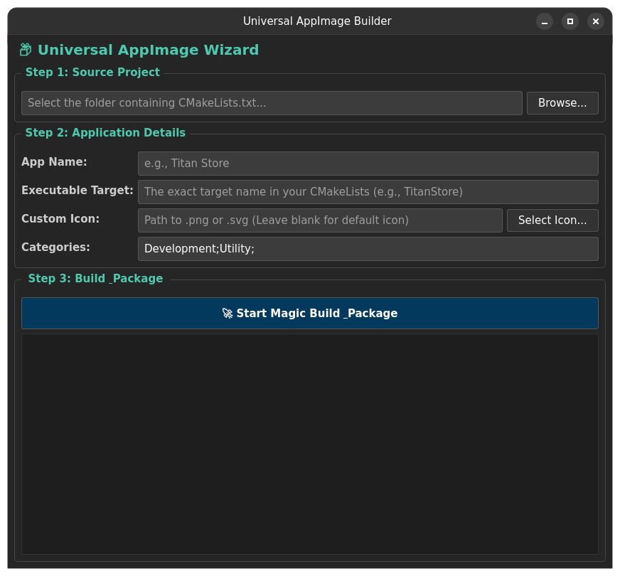

# AppImage Builder

A lightweight, automated graphical tool written in C++ and Qt6 that takes the headache out of packaging Linux applications. 

With a simple 3-step wizard, this tool will automatically compile your C++/Qt CMake projects and package them into standalone `.AppImage` files that can run on almost any Linux distribution.



---

## Features

* **Simple 3-Step Wizard:** No more dealing with complex terminal packaging commands.
* **Auto-Dependency Resolution:** Automatically downloads `linuxdeploy` and the `qt` plugin in the background.
* **Desktop Integration:** Generates `.desktop` files and injects custom `.png`/`.svg` icons into your AppImage automatically.
* **Smart CMake Validation:** Reads your target project's `CMakeLists.txt` to ensure the required `install()` commands are present *before* attempting to build.
* **Real-time Console:** Streams `cmake` and `make` logs directly into the UI so you know exactly what is happening.

---

## Prerequisites

To build and run this tool, you need basic C++ development tools and the Qt6 framework.

**For Ubuntu / Debian:**
```bash
sudo apt update
sudo apt install build-essential cmake qt6-base-dev file wget
```

*(Note: The `file` and `wget` utilities are strictly required for the packaging process to work).*

---

## Build Instructions

Compile the builder natively on your system using CMake:

```bash
git clone https://github.com/tiwut/AppImage-Builder.git
cd AppImage-Builder

# Build the tool
mkdir build
cd build
cmake ..
make
```

---

## How to Use

1. Launch the tool natively from your terminal:
   ```bash
   ./AppImageBuilder
   ```
2. **Step 1:** Browse and select the folder of the project you want to package (the folder containing its `CMakeLists.txt`).
3. **Step 2:** Enter the App Name, the exact **Executable Target Name** (as defined in the target's CMake file), and optionally select a custom icon.
4. **Step 3:** Click **Start Magic Build & Package**.

### Important Note for Target Projects
For the AppImage creation to succeed, the C++ project you are trying to package **must** have an install rule at the very bottom of its `CMakeLists.txt` file. 

Example:
```cmake
# If your executable is named TitanStore
install(TARGETS TitanStore DESTINATION bin)
```
If you forget this, the Builder's Smart Validation will catch it and warn you before compiling!

---

## License
This project is licensed under the [GPL v3 License](LICENSE).
